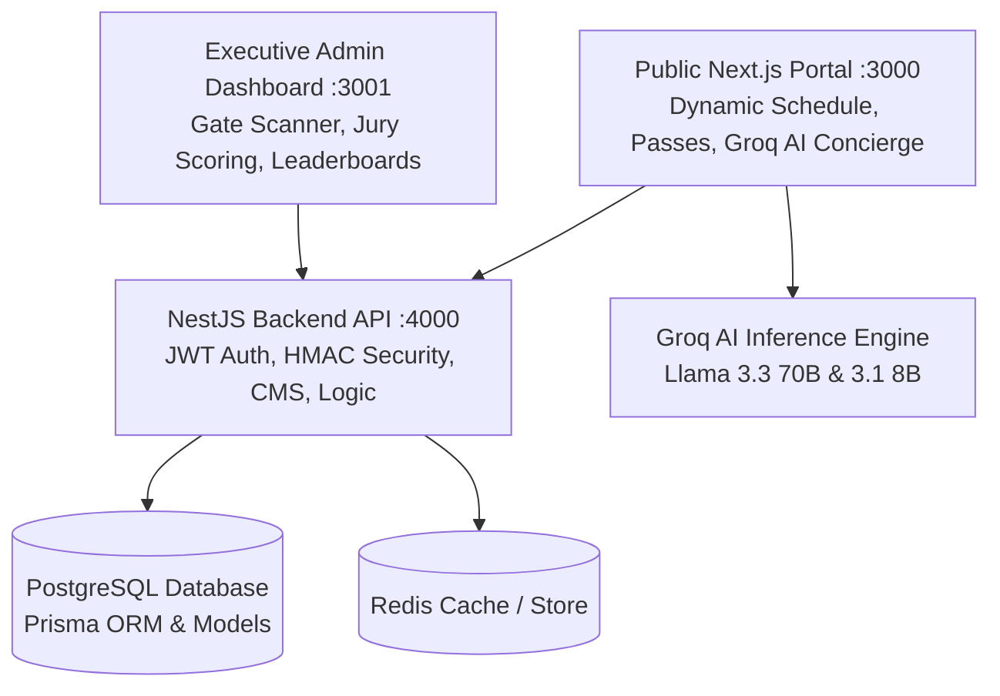

# ⚡ PEC E-Summit 2026 — High Voltage Platform

[](https://nextjs.org/)
[](https://reactjs.org/)
[](https://www.typescriptlang.org/)
[](https://tailwindcss.com/)
[](https://nestjs.com/)
[](https://www.prisma.io/)
[](https://groq.com/)
[](https://greensock.com/gsap/)

> **Official Full-Stack Digital Platform for PEC E-Summit 2026**  
> Hosted by **E-Cell, Punjab Engineering College (PEC), Chandigarh**.  
> North India's premier high-voltage entrepreneurship summit featuring 3,000+ delegates, 40+ startup visionaries, ₹15L+ in competition prize pools, and live investor dealflow.

---

## 🌟 Ecosystem Architecture

The platform is structured into three integrated service tiers:



| Service | Port | Directory | Tech Stack | Role |
| :--- | :---: | :--- | :--- | :--- |
| **Public Experience Portal** | `3000` | [`ESUMMIT/`](./) | Next.js 14, React 18, Tailwind, Framer Motion, Lenis | Public landing page, tracks, 3D speaker roster, dynamic pass checkout, AI Concierge |
| **Operations & Command Center** | `3001` | [`admin_dashboard/`](../E_Summit_Backend/admin_dashboard) | Next.js 16, Turbopack, Tailwind, Lucide, WebRTC | Volunteer Gate Scanner, Jury Pitch Rubrics, CMS Manager, CA Leaderboard |
| **Production API & Engine** | `4000` | [`E_Summit_Backend/`](../E_Summit_Backend) | NestJS 10, Prisma 6, PostgreSQL, Argon2id, JWT | RESTful API, HMAC QR tickets, Razorpay webhooks, RBAC authorization |

---

## ✨ Key Platform Features

### 1. 🤖 Official AI Concierge (`Groq Llama 3.3 70B`)
- **Ultra-Low Latency Inference**: Real-time natural language answers about the summit schedule, speakers, prize pools, and campus venues.
- **Intelligent RAG & Tool Execution**: Automatically executes actions like itinerary generation (`build_itinerary`), smooth scroll navigation (`scroll_to_section`), and activity lookups.
- **Zero-Downtime Resiliency**: Seamlessly falls back to local festival intelligence if network or quota thresholds are met.

### 2. 🎟️ Cryptographic QR Gate Check-In & Badging
- **HMAC-SHA256 Signed Passes**: Digital passes generated with unique IDs (`PEC-XXXXXX`) and tamper-proof HMAC signatures.
- **WebRTC Camera Scanner**: Real-time barcode/QR scanner with instant audio-visual chime feedback and camera power controls.
- **Replay & Duplicate Protection**: Detects scanned badges with sub-millisecond latency and immediately halts duplicate entries with detailed audit logs.

### 3. ⚖️ Startup Expo & Jury Scoring Engine
- **Pitch & Hackathon Team Hub**: Instant team creation with invite codes (`PITCH-XXXX` / `HACK-XXXX`), project deck uploads, and live GitHub repo links.
- **Multi-Criterion Jury Rubric**: Investors score startups from 1–10 across **Innovation**, **Execution**, **Market Size**, and **Pitch Quality**.
- **Real-Time Weighted Leaderboard**: Dynamic recalculation of team rankings and score breakdowns.

### 4. 🎨 High-Voltage Design System
- **Theme Palette**: Obsidian Void (`#060B08`), Radiant Volt Green (`#7ED321`), Crimson Flame (`#FF4D3D`), and Cyan Spark (`#3DD9FF`).
- **Kinetic Animations**: 60fps frame scrubbing, GSAP `ScrollTrigger` timelines, and Lenis inertial smooth scrolling.
- **Typography**: High-impact **Kanit** headings paired with **Inter** body text and **JetBrains Mono** data tickers.

---

## 🛠️ Technology Stack

```
Frontend (Public & Admin):
├── Framework: Next.js 14 / Next.js 16 (App Router)
├── Styling: Tailwind CSS 3.4 & Vanilla CSS Variables
├── Animations: Framer Motion 11, GSAP 3.15, Lenis Scroll, Anime.js
├── 3D Canvas: Three.js, React Three Fiber, Drei
└── AI Engine: Groq Cloud SDK (Llama 3.3 70B Versatile, Llama 3.1 8B Instant)

Backend API & Security:
├── Framework: NestJS 10 (Node.js LTS)
├── ORM & Database: Prisma ORM 6 & PostgreSQL 16
├── Authentication: Passport JWT, Refresh Token Family Rotation, Argon2id
├── Cryptography: Node.js Crypto HMAC-SHA256 Timing-Safe Verifications
└── Testing: Jest 29, @nestjs/testing, Supertest
```

---

## 🚀 Getting Started Locally

### 1. Prerequisites
- **Node.js**: `v18.17+` or `v20.x`
- **PostgreSQL**: `v15+` (or Docker for database container)
- **Package Manager**: `npm` (recommended)

---

### 2. Backend Setup & Database Seeding

```bash
# Navigate to backend directory
cd E_Summit_Backend

# Install dependencies
npm install

# Configure environment
cp .env.example .env

# Apply database migrations & seed initial schedule/users
npx prisma migrate dev
npm run db:seed

# Start backend server (Port 4000)
npm run start:dev
```

---

### 3. Public Frontend Portal Setup

```bash
# Navigate to public frontend directory
cd ../ESUMMIT

# Install dependencies
npm install

# Configure environment
cp .env.example .env.local

# Run production build or dev server (Port 3000)
npm run build
npm run start
# OR for hot-reload dev:
npm run dev
```

---

### 4. Admin Operations Dashboard Setup

```bash
# Navigate to admin dashboard directory
cd ../E_Summit_Backend/admin_dashboard

# Install dependencies
npm install

# Configure environment
cp .env.local.example .env.local

# Start admin dashboard (Port 3001)
npm run dev
```

---

## 🔑 Default Seeded Accounts (`PecSummit@2026`)

All pre-seeded demo accounts share the password **`PecSummit@2026`**:

| Role | Email | Permissions / Features |
| :--- | :--- | :--- |
| **Super Admin** | `admin@pecsummit.com` | Full command telemetry, user overrides, CMS control |
| **Organizer** | `organizer@pecsummit.com` | Schedule management, speaker updates, delegate exports |
| **Gate Volunteer** | `volunteer@pecsummit.com` | Live WebRTC QR scanner & attendee manual lookup |
| **Investor / Jury** | `investor@pecsummit.com` | Pitch evaluation, startup scoring rubrics |
| **Campus Ambassador**| `ca@pecsummit.com` | Referral link tracking, leaderboard rank |
| **Delegate** | `delegate@pecsummit.com` | Digital pass `PEC-894210`, workshop access |

---

## 🧪 Running Automated Tests

```bash
# Run all backend unit & integration test suites
cd E_Summit_Backend
npm test

# Run tests in watch mode
npm run test:watch

# Generate code coverage report
npm run test:cov
```

**Test Coverage Summary**:
- `src/auth/auth.service.spec.ts` (Authentication, hashing, JWT token rotation)
- `src/checkin/checkin.service.spec.ts` (HMAC QR ticket checks & anti-replay)
- `src/common/utils/qr.util.spec.ts` (Cryptographic signing & tampering detection)
- `src/admin/admin.service.spec.ts` (Analytics aggregation & CA calculations)
- `src/teams/teams.service.spec.ts` (Jury scoring & leaderboard algorithms)
- `src/cms/cms.service.spec.ts` (Festival events, speakers, and sponsors CMS)
- `src/health/health.controller.spec.ts` (Database & service health ping)

---

## 🏢 Organization & Contacts

**E-Cell PEC (Entrepreneurship Cell)**  
*Punjab Engineering College (Deemed to be University), Sector 12, Chandigarh - 160012*

- **Website**: [ecellpec.in](https://ecellpec.in)
- **Email**: `partnerships@pec-esummit.org` / `support@pec-esummit.org`
- **Instagram**: [@ecellpec](https://instagram.com/ecellpec)
- **LinkedIn**: [E-Cell PEC Chandigarh](https://linkedin.com/company/ecellpec)

---

<div align="center">
  <sub>Engineered with ⚡ by the E-Cell PEC Technology Team for PEC E-Summit 2026.</sub>
</div>