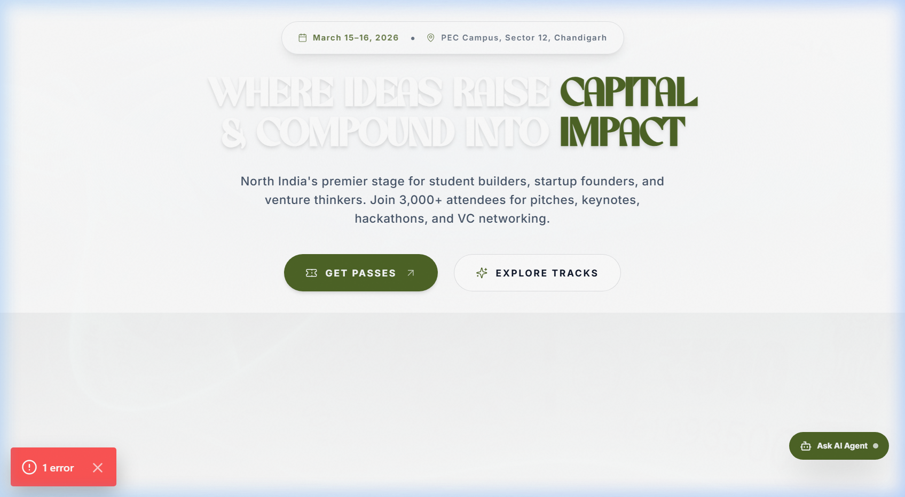
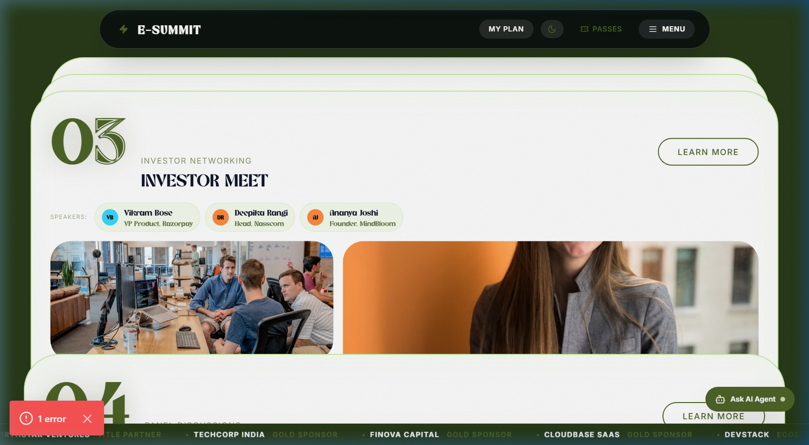

# PEC E-Summit '26

Official website for PEC E-Summit '26 — the flagship entrepreneurship summit of E-Cell Punjab Engineering College, Chandigarh.


---

## Preview





---

## What's Built

### Landing Page

A single-page experience composed of the following sections in order:

| Section | Description |
|---|---|
| Hero | 60fps scroll-scrubbed JPEG frame sequence. Full-viewport cinematic intro with scroll-driven animation |
| StatBurst | Animated counters — 3000+ attendees, 40+ speakers, ₹15L+ prize pool, 7 past editions. Triggered on intersection |
| Marquee | Dual-row scroll-parallax GIF showcase. Opposite scroll directions, motion-aware |
| About | Character-by-character text reveal on scroll. Three.js 3D decorative corner elements |
| Highlights | Sticky card-stacking section. Cards pin and stack as user scrolls through the section |
| Video Showcase | Second scroll-scrubbed JPEG frame sequence. Market Surge themed cinematic segment |
| Alumni | Horizontal scroll section with pixel-transition hover effect on alumni cards |
| Timeline | GSAP-driven full schedule. Day-by-day event timeline with animated entry |
| Sponsors | Auto-scrolling partner logo marquee |
| Register CTA | Full-width call-to-action banner before footer |
| FAQ | Accordion with animated expand/collapse |
| Footer | Links, social, organization info |
| AI Concierge | Floating chatbot widget, bottom-right. Handles event queries via a local agent |

### Sub-pages

| Route | What it contains |
|---|---|
| `/passes` | Ticket and pass selection with pricing tiers |
| `/register` | Full registration form |
| `/schedule` | Dedicated full schedule page |
| `/speakers` | Speaker directory with bios |
| `/sponsors` | Sponsor listing by tier |
| `/tracks` | Detailed breakdown of event tracks |
| `/faq` | Standalone FAQ page |

### Event Tracks

| Track | Format | Description |
|---|---|---|
| Pitch Competition | 5-min pitch + 5-min Q&A | Teams of 2–4 pitch to a jury of active investors. Categories: Pre-revenue, Revenue-stage, Social Impact. |
| Hackathon | 24 hours | Overnight build sprint. Problem statements revealed at kickoff. Judged on technical depth and demo. |
| Investor Networking | Structured sessions | Speed networking and open hours with seed-stage angels and tier-1 VC funds. |
| Panel Discussions | 60-min moderated | Topics: Fundraising in a Tough Climate, AI for Startups, Deep-Tech in India, Student-to-Founder Playbook. |
| Startup Expo | Open floor | 30+ student and early-stage startups exhibit live products to attendees and investors. |

### Confirmed Speakers

| Name | Title | Organization |
|---|---|---|
| Priya Nair | Partner | Surge Ventures |
| Arjun Mehta | Co-founder & CTO | Kira.ai |
| Deepika Rangi | Head of Startup Ecosystem | Nasscom |
| Sameer Khanna | Angel Investor | ex-Sequoia EIR |
| Ritu Sharma | Founder | GreenMile Logistics |
| Vikram Bose | VP Product | Razorpay |
| Ananya Joshi | Founder | MindBloom EdTech |
| Kabir Singh | CTO | Stealth Agri-Startup |

### Sponsors & Partners

| Tier | Partners |
|---|---|
| Title | NorthStar Ventures |
| Gold | TechCorp India, Finova Capital, CloudBase SaaS |
| Ecosystem | DevStack, InnoHub, Launchpad AI, Seed & Grow, PitchDeck Pro, MentorBridge |
| Media | StartupStory, YourStory, INC42, Entrepreneur India, TechCircle, The Economic Times |

### Key Technical Features

- **Scroll-scrubbed frame animation** — Hero and Video Showcase preload JPEG sequence frames and render the correct frame based on scroll position, creating a 60fps video-like effect with no video file
- **AI Concierge** — floating chatbot with a local agent (`Concierge/agent.ts`) that answers questions about the summit
- **Lenis smooth scroll** — wraps the entire app for physics-based scroll inertia
- **Reduced motion support** — `useReducedMotion` hook disables animations for users with `prefers-reduced-motion: reduce`
- **Dynamic imports with SSR disabled** — `Timeline`, `Concierge`, and `Alumni` use `next/dynamic` + `ssr: false` to safely use browser-only APIs

---

## Stack

| Layer | Technology |
|---|---|
| Framework | Next.js 14 (App Router) |
| Language | TypeScript 5, strict mode |
| Styling | Tailwind CSS 3 with CSS custom properties |
| Animation | Framer Motion, GSAP, Anime.js |
| 3D | Three.js via `@react-three/fiber` and `@react-three/drei` |
| Smooth Scroll | Lenis |
| Maps | Leaflet |
| Fonts | Khaviax (local OTF), Inter, JetBrains Mono (Google Fonts) |
| Notifications | react-hot-toast |

---

## Project Structure

```
.
├── app/                        # Next.js App Router pages
│   ├── layout.tsx              # Root layout — fonts, metadata, smooth scroll provider
│   ├── page.tsx                # Landing page — all sections composed here
│   ├── faq/
│   ├── passes/
│   ├── register/
│   ├── schedule/
│   ├── speakers/
│   ├── sponsors/
│   └── tracks/
│
├── components/
│   ├── Hero/NewHero.tsx         # 60fps scroll-scrubbed frame animation hero
│   ├── StatBurst/               # Animated stats counter
│   ├── EsummitMarquee/          # Scroll-parallax GIF marquee rows
│   ├── EsummitAbout/            # Character-by-character text reveal + Three.js decor
│   ├── EsummitSpeakers/         # Sticky card-stacking highlights section
│   ├── Vdo2Showcase/            # Second scroll-scrubbed frame showcase
│   ├── Alumni/                  # Horizontal scroll with pixel transition
│   ├── Timeline/                # GSAP-driven schedule (SSR disabled)
│   ├── Sponsors/                # Logo marquee
│   ├── FAQ/                     # Accordion
│   ├── Footer/                  # Footer + RegisterCTA (named export)
│   ├── Nav/                     # Navigation bar
│   ├── Concierge/
│   │   ├── index.tsx            # Floating chatbot UI
│   │   └── agent.ts             # Conversation logic and state
│   ├── Providers/
│   │   └── SmoothScrollProvider.tsx  # Lenis wrapper
│   ├── Common/                  # Shared utility components
│   ├── ui/                      # Primitive UI components
│   └── DynamicWeightHeading/
│
├── lib/
│   ├── data.ts                  # All static content — meta, stats, tracks, speakers, schedule, sponsors, FAQ
│   └── events.ts                # Event type definitions
│
├── hooks/
│   ├── useCountUp.ts            # Intersection-triggered number counter
│   └── useReducedMotion.ts      # prefers-reduced-motion wrapper
│
├── public/
│   ├── sequence/                # JPEG frames for hero scroll scrubbing
│   └── vdo/                     # JPEG frames for Vdo2Showcase scroll scrubbing
│
└── .github/
    ├── workflows/
    │   ├── ci.yml               # Lint → typecheck → build
    │   └── lighthouse.yml       # Performance audit on main
    ├── lighthouse-budget.json
    └── dependabot.yml
```

---

## Data

All static content is in `lib/data.ts`. Update the following exports to change site content:

| Export | Controls |
|---|---|
| `FEST_META` | Event name, dates, venue, countdown target, social links |
| `STATS` | Counter values shown in StatBurst |
| `TRACKS` | Event categories — pitch, panels, expo, hackathon, networking |
| `SPEAKERS` | Speaker roster — name, title, company, image, topic |
| `SCHEDULE` | Day-by-day timeline entries |
| `SPONSORS` | Sponsor logos and tier groupings |
| `FAQ_ITEMS` | FAQ accordion content |

---

## Getting Started

**Prerequisites:** Node.js 20+, npm

```bash
npm install
npm run dev
```

Dev server runs at `http://localhost:3000`.

---

## Available Scripts

| Script | Description |
|---|---|
| `npm run dev` | Start development server |
| `npm run build` | Production build |
| `npm run start` | Start production server |
| `npm run lint` | ESLint |
| `npm run typecheck` | TypeScript check without emit |
| `npm run format` | Prettier — write all files |
| `npm run format:check` | Prettier — check only |

---

## Design System

Defined in `app/globals.css` as CSS custom properties, aliased in `tailwind.config.js`.

**Colors:**

| Token | Tailwind Alias | Role |
|---|---|---|
| `--bg-void` | `bg-void` | Primary dark background |
| `--bg-panel` | `bg-panel` | Card backgrounds |
| `--accent-mint` | `mint` | Primary CTA, highlights |
| `--accent-green` | `green`, `volt` | Secondary accent |
| `--accent-blue` | `blue` | Info accent |
| `--accent-coral` | `coral`, `orange`, `amber` | Warm accent |
| `--text-primary` | `text-primary` | Body text |
| `--text-secondary` | `text-secondary` | Subdued text |
| `--text-muted` | `text-muted` | Caption / placeholder |

**Fonts:**

| CSS Variable | Tailwind Alias | Usage |
|---|---|---|
| `--font-khaviax` | `font-display` | Display headings |
| `--font-inter` | `font-body` | Body text |
| `--font-jetbrains` | `font-mono` | Data labels, code |

---

## CI/CD

### GitHub Actions

**`ci.yml`** — on push/PR to `main` and `develop`:
1. ESLint
2. TypeScript type check
3. Production build (runs only if 1 and 2 pass)

**`lighthouse.yml`** — on push to `main`:
- Builds and runs Lighthouse audit
- Reports uploaded as workflow artifacts
- Checked against size budgets in `.github/lighthouse-budget.json`

### Deployment

Configured for Vercel via `vercel.json` (region: `bom1` — Mumbai). Connect the GitHub repo to Vercel:
- Push to `main` → production deploy
- Any PR → preview URL

### Pre-commit

`husky` + `lint-staged` run ESLint and Prettier on staged files before every commit. Activated automatically on `npm install` via the `prepare` script.

### Dependency Updates

Dependabot opens weekly PRs for outdated npm packages, grouped by production and development dependencies.

---

## Performance Notes

- Frame sequences in `public/sequence/` and `public/vdo/` should be kept under 80KB per frame
- `Timeline`, `Concierge`, and `Alumni` are SSR-disabled via `next/dynamic` — they use browser-only scroll and canvas APIs
- Leaflet is loaded via CDN `<script>` tag in `layout.tsx` to avoid SSR issues

---

## Branch Strategy

| Branch | Purpose |
|---|---|
| `main` | Production |
| `develop` | Integration — merge features here first |
| `feature/*` | Feature or fix branches |

Direct push to `main` should be blocked via GitHub branch protection. All changes via pull request.

---

## Organization

E-Cell PEC — Entrepreneurship and Incubation Cell, Punjab Engineering College, Sector 12, Chandigarh — 160012

---

## Contact

| Purpose | Email |
|---|---|
| Sponsorship & Collaboration | eicpec@pec.edu.in |
| General Queries | info@ecellpec.in |

---

## License

All source code in this repository is proprietary and owned by the Entrepreneurship and Incubation Cell, Punjab Engineering College. Unauthorized use, copying, or distribution outside of authorized contributors is not permitted.