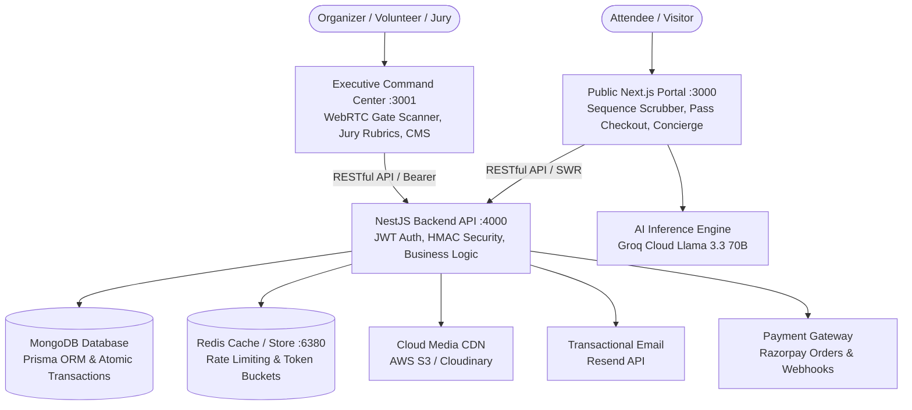

# PEC E-Summit 2026

[](https://nextjs.org/)
[](https://reactjs.org/)
[](https://www.typescriptlang.org/)
[](https://tailwindcss.com/)
[](https://nestjs.com/)
[](https://www.prisma.io/)
[](https://www.mongodb.com/)
[](https://www.docker.com/)

> Official digital platform for PEC E-Summit 2026.  
> Built and maintained by the Entrepreneurship and Incubation Cell (EIC), Punjab Engineering College (PEC), Chandigarh.

---

## Ecosystem Architecture

The platform operates as a high-availability, multi-tiered monorepo:



### Service Tiers Summary

| Service | Port | Directory | Tech Stack | Role & Capabilities |
| :--- | :---: | :--- | :--- | :--- |
| **Public Experience Portal** | `3000` | `frontend/` | Next.js 15 (App Router), React 18, Tailwind 3.4, Framer Motion, GSAP | Public landing page, interactive track showcases, multi-step pass checkout, AI Concierge. |
| **Operations Command Center** | `3001` | `admin/` | Next.js 16 (Turbopack), React 19, Tailwind v4, NextAuth v5, WebRTC | Live WebRTC QR gate scanner, attendee management, CMS controllers, system feature flags. |
| **Production API Engine** | `4000` | `backend/` | NestJS 10, Prisma 6, MongoDB, Argon2id, JWT, Crypto | Core REST API, cryptographic HMAC-SHA256 ticket minting, Razorpay verification, Resend emails. |

---

## Key Platform Features

### 1. AI Festival Concierge
- Grounded festival intelligence powered by Groq Cloud (`llama-3.3-70b-versatile` with `llama-3.1-8b-instant` fallback).
- Answers attendee queries regarding speaker line-ups, venues, session timings, and competition tracks.
- Supports client-side UI action directives (e.g. programmatically scrolling to specific sections or highlighting events).
- Built-in static local fallback ensures continuous availability even during upstream API outages.

### 2. Cryptographic Gate Check-In & Anti-Replay
- Every minted ticket carries an immutable `PEC-XXXXXX` ID and an HMAC-SHA256 cryptographic signature.
- WebRTC camera scanner in the Admin Command Center (`html5-qrcode`) validates tickets in milliseconds.
- Server-side atomic status tracking eliminates double-scanning and replay attacks at physical gates.

### 3. Pass Registration & Razorpay Integration
- Multi-step registration flow supporting Student, Founder, Builder, and Campus Ambassador tiers.
- Integrated with Razorpay for real-time payment order generation and cryptographic signature validation.
- Automated webhook listener (`/api/v1/payments/webhook`) reconciles asynchronous payment confirmations.
- Automated email delivery of the digital ticket and QR pass via the Resend API.

### 4. 60FPS Video Frame Scrubber & Event Portfolio
- Hero canvas utilizes Web Workers and `createImageBitmap` for memory-efficient frame scrubbing without heavy video decoding overhead.
- Interactive, horizontally scrollable event portfolio with category filtering (Pitch, Hackathon, Workshops, Competitions).
- Modal detail views displaying rules, judging criteria, prize breakdowns, and direct registration links.

### 5. Startup Expo & Jury Pitch Rubrics
- Startups create teams via invite join codes (`HACK-XXXX`) and attach GitHub repos, pitch decks, and live demo links.
- Dedicated jury interface featuring a standardized 4-pillar rubric (Innovation, Execution, Market Opportunity, Presentation).
- Dynamically calculates weighted team scores and publishes live leaderboards.

### 6. Campus Ambassador (CA) Program
- Custom referral links allow Campus Ambassadors to promote passes across universities.
- Real-time leaderboard aggregates referral registrations and computes ambassador points automatically.

### 7. Headless Festival CMS & Feature Flags
- Real-time control over Day 1 and Day 2 timelines, speaker profiles, sponsor hierarchies, and gallery items.
- Dynamic system toggles: Emergency Maintenance Mode, Pass Sales Switches, and Live Broadcast Marquee Banner.

---

## Event Tracks & Festival Highlights

| Track | Category | Description |
| :--- | :--- | :--- |
| **Pitch Competition** | Founders Stage | Seed-stage startups pitch live to VCs, angel networks, and industry mentors. |
| **24-Hour Hackathon** | Builder Arena | High-velocity build sprint tackling challenges in AI, Web3, Deep-Tech, and Climate. |
| **Keynote & Panels** | Thought Leadership | Fireside chats and panel discussions with unicorn founders, CXOs, and policymakers. |
| **Startup Expo** | Show & Tell | Early-stage products and student innovations showcased directly to festival attendees. |
| **Networking Mixer** | Ecosystem Connect | Speed networking, 1-on-1 investor office hours, and attendee mixer. |

---

## Project Structure

```text
E-SUMMIT/
├── frontend/                   # Public Experience Portal (Next.js 15)
│   ├── app/                    # App Router routes, layouts, and API endpoints
│   ├── components/             # UI components, 3D canvases, frame scrubber, and modals
│   ├── hooks/                  # Custom hooks (useSummitData, useHeroFrameScrubber)
│   ├── lib/                    # API clients, prefetch utilities, and festival metadata
│   └── public/                 # Static assets, image sequences, and branding
├── backend/                    # Production API Engine (NestJS 10)
│   ├── src/                    # Feature modules (auth, checkin, cms, registrations, teams)
│   ├── prisma/                 # MongoDB Prisma schema (schema.prisma) & seed script
│   ├── test/                   # Jest unit and integration test suites
│   └── scripts/                # Database utilities and migration helpers
├── admin/                      # Operations Command Center (Next.js 16)
│   ├── app/                    # Dashboard pages (gate scanner, CMS, analytics, config)
│   ├── components/             # Reusable admin datatables, scanner, and charts
│   └── lib/                    # Admin API clients and NextAuth session context
├── .github/workflows/          # CI pipelines and zero-downtime automated deployment
├── nginx/                      # Production reverse proxy and rate limit rules
├── docker-compose.yml          # Production container orchestration
├── docker-compose.dev.yml      # Local development container orchestration
├── CONTRIBUTING.md             # Developer guidelines, branching, and commit conventions
├── DESIGN_SYSTEM.md            # Color tokens, typography, and styling guidelines
└── DEVOPS.md                   # VPS provisioning, domain setup, and infrastructure guide
```

---

## Getting Started Locally

### 1. Prerequisites
- **Node.js**: `v20.x` LTS recommended (v18.18+ supported)
- **MongoDB**: `v6.0+` (MongoDB Atlas connection string or local replica set `rs0`)
- **Package Manager**: `npm`
- **Git**: Installed with submodule support

---

### 2. Clone Repository with Submodules

This repository contains submodules for `admin` and `backend`. Clone with the `--recursive` flag:

```bash
# Clone with submodules
git clone --recursive https://github.com/EIC-PEC/E-Summit-26.git
cd E-Summit-26

# If already cloned without --recursive:
git submodule update --init --recursive
```

---

### 3. Environment Configuration

Copy the example environment files across all three services:

```bash
# Backend
cp backend/.env.example backend/.env

# Frontend
cp frontend/.env.example frontend/.env.local

# Admin Dashboard
cp admin/.env.example admin/.env.local
```

#### Key Environment Variables

| File | Variable | Purpose |
| :--- | :--- | :--- |
| `backend/.env` | `DATABASE_URL` | MongoDB connection string (must include replica set for transactions) |
| `backend/.env` | `JWT_ACCESS_SECRET` | 64-char secret for signing short-lived access tokens |
| `backend/.env` | `JWT_REFRESH_SECRET` | 64-char secret for refresh token family rotation |
| `backend/.env` | `QR_HMAC_SECRET` | Cryptographic secret for signing attendee HMAC tickets |
| `backend/.env` | `RAZORPAY_KEY_ID` | Razorpay API Key for pass checkout |
| `backend/.env` | `RESEND_API_KEY` | Resend API Key for digital ticket confirmation emails |
| `frontend/.env.local` | `NEXT_PUBLIC_API_URL` | Endpoint to NestJS backend (`http://localhost:4000/api/v1`) |
| `frontend/.env.local` | `GROQ_API_KEY` | Groq Cloud API key for the AI Festival Concierge |
| `admin/.env.local` | `AUTH_SECRET` | NextAuth v5 session encryption secret |
| `admin/.env.local` | `NEXT_PUBLIC_API_BASE_URL` | Endpoint to NestJS backend (`http://localhost:4000/api/v1`) |

---

### 4. Monorepo Root Shortcuts

From the root repository directory, launch or build any tier:

```bash
# Start Frontend (:3000) and Backend (:4000) concurrently
npm run dev

# Start Admin Command Center (:3001)
npm run dev:admin

# Start Backend API only (:4000)
npm run dev:backend

# Production Builds
npm run build          # Public Frontend
npm run build:admin    # Admin Dashboard
npm run build:backend  # Backend API
```

---

### 5. Manual Service Setup

#### Backend Setup (`backend/`)
```bash
cd backend
npm install
npx prisma generate
npx prisma db push
npm run db:seed
npm run start:dev
```
*Backend runs at `http://localhost:4000/api/v1`. Health endpoint: `http://localhost:4000/api/v1/health`.*

#### Public Frontend Setup (`frontend/`)
```bash
cd frontend
npm install
npm run dev
```
*Frontend runs at `http://localhost:3000`.*

#### Admin Command Center Setup (`admin/`)
```bash
cd admin
npm install
npm run dev
```
*Admin Dashboard runs at `http://localhost:3001`.*

---

## Default Seeded Accounts

All pre-seeded demo accounts share the default password **`PecSummit@2026`**:

| Role | Email | Permissions / Features |
| :--- | :--- | :--- |
| **Super Admin** | `admin@pecsummit.com` | Full telemetry, CMS overrides, feature flags, user management |
| **Organizer** | `organizer@pecsummit.com` | Schedule management, speaker updates, attendee export |
| **Gate Volunteer** | `volunteer@pecsummit.com` | WebRTC live QR ticket scanner & manual attendee search |
| **Investor / Jury** | `investor@pecsummit.com` | Pitch evaluation & startup team scoring rubrics (1-10) |
| **Campus Ambassador** | `ca@pecsummit.com` | Referral link tracking & ambassador leaderboard rank |
| **Delegate** | `delegate@pecsummit.com` | Digital pass with HMAC-SHA256 QR code |

---

## Docker & Container Orchestration

Run the entire multi-tier platform in isolated containers:

```bash
# Start all containers in development mode (with volume hot-reloading)
docker compose -f docker-compose.dev.yml up --build

# Start production containers (Behind Nginx reverse proxy)
docker compose up --build -d

# View live container logs
docker compose logs -f

# Stop all containers
docker compose down
```

For advanced Nginx SSL termination, Certbot configurations, and VPS guides, see [DEVOPS.md](./DEVOPS.md).  
For styling, tokens, and visual standards, see [DESIGN_SYSTEM.md](./DESIGN_SYSTEM.md).

---

## Automated Testing & CI/CD Pipelines

### Running Automated Tests

```bash
# Run backend unit & integration tests (61 tests across 9 suites)
cd backend
npm test

# Run tests in watch mode
npm run test:watch

# Generate code coverage report
npm run test:cov

# Run ESLint validation
npm run lint

# TypeScript strict typechecking
npm run typecheck
```

### GitHub Actions Workflows

1. **Root CI (`.github/workflows/ci.yml`)**:
   - Runs in parallel across 3 matrix jobs: `Backend (NestJS + Prisma)`, `Admin CMS (Next.js 16)`, `Frontend (Next.js 15)`.
   - Validates linting, strict typing, unit tests, and production compilation on every push and pull request.
2. **Submodule Standalone CI (`backend/.github/` & `admin/.github/`)**:
   - Executes independent test pipelines within submodules to verify changes before pointer updates.
3. **Production Deploy (`.github/workflows/deploy.yml`)**:
   - Triggers on push to `main`.
   - Re-validates production builds across all 3 tiers.
   - Deploys to the production VPS via SSH with a **5-attempt health check retry loop** testing `http://localhost:4000/api/v1/health`.
   - **Automated Rollback**: If health checks fail, the workflow immediately executes an automated rollback to the previous stable commit and restarts production containers to guarantee zero downtime.

---

## Organization & Contacts

**E-Cell PEC (Entrepreneurship and Incubation Cell)**  
*Punjab Engineering College (Deemed to be University), Sector 12, Chandigarh - 160012*

- **Website**: [ecellpec.in](https://ecellpec.in)
- **Live Platform**: [pecesummit.vercel.app](https://pecesummit.vercel.app)
- **Email**: support@pec-esummit.org

<div align="center">
  <sub>Engineered with precision by the E-Cell PEC Engineering Team.</sub>
</div>